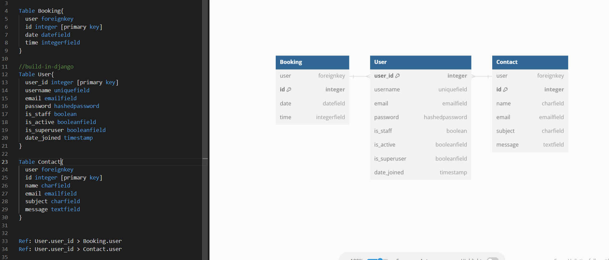
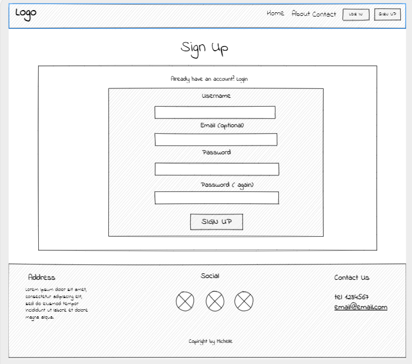

# HerBody

## Am I responsive image 

_____________________________________________________________________________

### Link to the finished site: [LINK](https://her-body.herokuapp.com/)

_____________________________________________________________________________

## Content:
- ### Project Goals and target audience
    - [Achieved](#achieved)
    - [Future implements](#future-projects)
    - [Audience](#audience)
- ### Project management
    - [Agile method ](#agile-method)
    - [Site user goal](#site-user-goal)
    - [Site owner goal](#site-owner-goal)
    - [User Stories](#user-stories)
- ### Wireframes and templates
    - [Database Structure](#database-structure)
    - [Wireframes](#wireframes)
- ### Main functionality
    - [Booking functionality](#booking-functionality)
        - [Create a session](#create-a-session)
        - [View all your sessions](#view-all-your-sessions)
        - [Edit a session](#edit-a-session)
        - [Delete a session](#delete-a-session)
        - [Confirm a session](#confirm-a-session)
    - [Contact](#contact)
    - [Account](#account)
        - [Login](#login)
        - [Register](#register)
        - [Logout](#logout)
- ### Design and Features
    - [Design and Features element](#design-and-features-element)
        - [Navbar](#navbar)
        - [Home page](#home-page)
        - [Footer](#footer)
        - [Messages](#messages)
        - [Error pages](#error-pages)
    - [Colour Scheme](#colour-scheme)
    - [Typography](#typography)
    - [Images](#images)
- ### Technologies Used
    - [Languages used](#languages-used)
    - [Frameworks, Packages & Programs Used](#frameworks-packages--programs-used)
        - [Python packages installed](#python-packages-installed)
        -[Programs used](#programs-used)
- ### Testing
    - [TESTING](#testing)
- ### Deployment
    - [Deployment](#deployment)
- ### Credits
    - [Code](#code)
    - [Acknowledgements](#acknowledgements)

_____________________________________________________________________________
## Project goals and target audience.  
### Achieved:

-   Creating a website where users can register, login and logout.
-   Creating a website for a company where you can book your private sessions, see unavailable ones and edit or delete them.
-   Creating a website where the user can contact the company, and receive a confirmation email.

### Future projects: 

-   Creating a website where users could choose between 3 different trainers.
-   Creating a website where users could reset their password and email, and create their profile.
-   Creating a website where after submitting the form user will receive a real email.

### Audience:

- The target audience for the website is only girls.
- Medium age between 15 / 60 years old.
- Girls interested in getting in good shape and in getting private one on one self-defense lessons that the company offers.

#### Current Users:

- Current users have different ways to contact the company, such as phone numbers, email, and a direct contact form on the website.
- Current users can login, and book and manage their sessions directly from the website.
- Current users can at any time delete their profile.

#### New users:

- New users can see what the company offers on the website.
- New users are tempted to register and login thanks to an only-login user feature that offer them 2 free sessions per week to book directly from the website.

[Back to top](#herBody)

_____________________________________________________________________________ 
## Project management

### Agile method

- HerBody was developed using an agile method. That includes using GitHub issues, user stories, and Kanban boards.
- That gave me an overview of tasks structured in a to-do, in-progress, and done way.

The project was divided into different iterations to divide the issues and the user stories in the main Epics.
Inside each Iteration ( Epic ) developer created different issues, user stories, tasks, and bugs, and differentiate the Iteration into different Boards.
Below are shown the links for:
1. The iteration
2. The main board user 
3. Small description for the Iteration

#### Iteration 1:

1. [Iteration 1](https://github.com/michmattera/HerBody/milestone/2?closed=1)
2. Starting to create core functionality, superuser, and administrator tasks.
3. [Board 1](https://github.com/users/michmattera/projects/3)

#### Iteration 2:

1. [Iteration 2](https://github.com/michmattera/HerBody/milestone/3?closed=1)
2. Create login and logout functionality, with html templates to display to the user.
3. [Board 2](https://github.com/users/michmattera/projects/4)

#### Iteration 3:

1. [Iteration 3](https://github.com/michmattera/HerBody/milestone/4?closed=1)
2. Create booking models, and main functionality.
3. [Board 3](https://github.com/users/michmattera/projects/5)

#### Iteration 4:

1. [Iteration 4](https://github.com/michmattera/HerBody/milestone/5?closed=1)
2. Second part main functionality for booking. Create models and views to delete and style booking functionality.
3. [Board 4](https://github.com/users/michmattera/projects/6)

#### Iteration 5:

1. [Iteration 5](https://github.com/michmattera/HerBody/milestone/6?closed=1)
2. Creating a contact page, basic functionality, and basic CSS.
3. [Board 5](https://github.com/users/michmattera/projects/7)

#### Iteration 6:

1. [Iteration 6](https://github.com/michmattera/HerBody/milestone/7)
2. Style all pages, link Coudinary pictures, and create a logo.
3. [Board 6](https://github.com/users/michmattera/projects/8)

#### Iteration 7:

1. [Iteration 7](https://github.com/michmattera/HerBody/milestone/8)
2. Focus on finishing the style for booking pages and media queries.
3. [Board 7](https://github.com/users/michmattera/projects/9)

#### Iteration 8:

1. [Iteration 8](https://github.com/michmattera/HerBody/milestone/9)
2. Focus on deploying again the project to Heroku, fixing important bugs and API, and start automated and manual testing.
3. [Board 8](https://github.com/users/michmattera/projects/10)

#### Iteration 9:

1. [Iteration 9](https://github.com/michmattera/HerBody/milestone/10)
2. Focus on manual and automated testing.
3. [Board 9](https://github.com/users/michmattera/projects/11)

#### Iteration 10:

1. [Iteration 10](https://github.com/michmattera/HerBody/milestone/11)
2. Finish ReadMe and Testing.
3. [Board 10](https://github.com/users/michmattera/projects/12)

### Site User Goal

Site user has different goals:

- Being able to login
- Being able to logout
- Being able to register
- Being able to contact the company for any information or issues
- Being able to book a private session
- Being able to see available and unavailable sessions
- Being able to see what features the company offers
- Being able to delete or edit the session

### Site Owner Goal

The site owner has been given a superuser, which has different features than a normal user.
The site owner has different goals:

- Being able to see all sessions booked
- Being able to see all contacts form submitted
- Being able to see all contacts information for the user
- Being able to see available and unavailable sessions
- Being able to attract as many new users as possible
- Being able to delete all sessions
- Being able to give as much information on the company to give transparency
- Being able to authenticate users with passwords to give extra security to the account created
- Being able to accept free sessions just for logged-in users, so that they have to create an account to be able to book it

### User stories

User stories were divided for Iteration ( Epic ), they were then divided in :

- Must-Have
- Should-Have
- Could-Have
- Won't-Have

[Back to top](#herBody)

_____________________________________________________________________________ 
## Wireframes and templates.  

### Database structure

The database structure and explanation are to be found below.

**Django User Model** is the main model used, where the booking and the contact model are connected.
- The register model is the one that uses directly the Django build-in model. Where it stores mainly :
    - Username
    - Email
    - Password
- The booking model stores, the time, and date for the booking, and it is linked to the user foreign key of the Django model.
- Contact model on the other hand for logged and not logged users. If the user is logged in that it links as well to the user's foreign key. If not it saves just all the info in the contact.

Both of the models have their folder and are divided in the admin panel as well under:

1. Booking
2. Contact

Database scheme

### Wireframes

Wireframes were used to structure the website, all main pages were structured after the wireframes.
Other pages as error pages, logout confirmation, and contact confirmation were created by the developer for better UX after the creation of wireframes.
 
Main changes:

- Book a session, changed for a table where the 3 slots are listed for each day.
- Contact page change the form for one column instead of two.

Wireframe mobile phone

Wireframe desktop home

Wireframe desktop about

Wireframe desktop contact

Wireframe desktop book a session

Wireframe desktop booking list

Wireframe desktop login

Wireframe desktop register

[Back to top](#herBody)

_____________________________________________________________________________ 

## Main functionality

### Booking functionality

Just logged-in users can access the booking functionality.
All booking functionality has been created in the Booking folder, then divided in :

- [Booking views](booking/views.py "Link to booking views")
- [Booking forms](booking/forms.py "Link to booking forms")
- [Booking models](booking/models.py "Link to booking models")
- [Booking url](booking/urls.py "Link to booking url")

#### Create a session

Creating a session is the first functionality created for the CRUD.
 
Users can create a session in [Book a session template](templates/booking/booking_form.html "Link to book a session template").
 
 
In this template, it is shown to the user based on the day of the week and the available slots.

- Monday is closed so is always excluded
- Past dates are excluded
- The user has to book from 1 day before, so the same day should be excluded as well

For each day the user can choose between 3 different slots:
- At 9 am
- At 11 am
- At 16 pm 

 
If the slot is available the user can click the slot and will be brought to the booking confirmation template, where the user can confirm or cancel the booking. Will then be redirected to the booking list.

#### View all your sessions

All the bookings are shown to the user in the [Booking list template](templates/booking/booking_list.html "Link to booking list template") where the booking summary will appear, bringing the user to the Read of the CRUD functionality.
Here a summary of the booking user, booking date, and time will appear.
As well here the user will have the possibility to edit or delete the booking.

Book a session, confirm, and view session

#### Edit a session

If the user clicks on edit booking he will be brought to a similar page to when he wanted to book a session, with the same functionality, where as well he will see all the sessions available and not, and where the session clicked by the user to edit is still unavailable [Edit booking template](templates/booking/edit_booking.html "Link to edit booking template").
 
 
Similar to the book-a-session functionality, he will be brought to a confirmation page.

#### Delete a session

If the user clicks on the delete booking [Delete Booking template](templates/booking/delete_booking.html "Link to delete booking template") where a confirmation to the user will appear.
 
 
The user will have 2 choices :

1. Confirm = The booking will be deleted, and the user redirected to the booking list template
2. Cancel = The user will just be redirected to the booking list page, and the booking will still be there.

Delete Booking functionality

#### Confirm a session

When the user book a new session, or clicks on edit a new session, after selecting the slot, they will be brought to a confirmation page.
 
 
[Confirmation template](templates/booking/booking_confirmation.html "Link to booking confirmation template")
 
 
They are slightly different:

1. From book a session = The page will show a summary of the booking
2. From edit a session page = The page will show a summary of the old booking and a summary of a new one.
 
 
The user will have 2 choices :

- Confirm = The booking will be saved, and the user redirected to the booking list template.
- Cancel = The user will just be redirected to the booking list page, and the booking will still be there.

Both are shown above .
_____________________________________________________________________________

 ### Contact

Contact page functionality will have a form, where the user will be prompted to enter:

- Name
- Email
- Subject
- Message

If the user is logged in then automatically the name and the email will be inserted, while if the user is not logged in no.
The user then will have a success message and will be redirected to a contact confirmation page, just to confirm the correct submission of the form.

Contact functionality

_____________________________________________________________________________

 ### Account

 Account templates can be found in an account folder, where there will be:

- Login
- Register
- Logout

 ### Login

 The [Login template](templates/account/login.html "Link to login template") is a form where the user will be prompted to ask just the username and the password.
 If the username or the password is not correct then it will show an error message.
 If not then the user will be redirected to the home page.

 

Login functionality

 ### Register

 The [Register template](templates/account/register.html "Link to register template") is a form where the user will be prompted to ask just the username, the email, the password, and a confirmation of the password.
 If there is any error in the form then it will show a error message.
 If not it will be redirected to the login page.

 

Register functionality

 ### Logout

 The [Logout template](templates/account/logout.html "Link to logout template") is a template page where the user will be asked to confirm if he wants to log out or not.
 He will have two choices:

 1. Confirm = Logging out the user, redirecting to the homepage.
 1. Cancel = Just redirecting him to the previous page.

 

Logout functionality

[Back to top](#herBody)

_____________________________________________________________________________ 

## Design and features

### Design and features element

The design and features throughout the page are consistent.
The following pages are available just for logged-in users:

- [Book a session](templates/booking/booking_form.html)
- [Booking confirmation](templates/booking/booking_confirmation.html)
- [Booking delete](templates/booking/delete_booking.html)
- [Booking edit](templates/booking/edit_booking.html)
- [Booking edit confirm](templates/booking/edit_booking_confirm.html)
- [Logout](templates/accounts/logout_confirmation.html)

#### Navbar

The navbar has the following common and different features base on different media query sizes:

##### Common features =

1. Fixed on the top.
2. Dropdown is different if the user is logged in or not:
    - Logged-in user = Will have displayed book a session, my bookings, and logout button
    - Not logged-in user = Will have displayed Login and Register

##### For screen bigger than 992px =

1. When the userland in the page, it does not have any background color, but when scrolling down, it becomes bigger and takes the main color #d63384 as his background
2. Elements inside the navigation bar are all displayed and divided from right and left:
    - Home, About, Contact, Dropdown on the right
    - Logo on the left

##### For screen smaller than 992px =

1. When the user land on the page, it does have a dark background #241e30.
2. Elements inside the navigation bar are all displayed and divided from right and left:
    - Menu dropdown on the right
    - Logo on the left
3. The dropdown menu will then open all the elements on the left when clicked

 

Navbar

#### Home page

The homepage is divided into different sections:

- The first one with a 100% background image with a small text on the top and a button that differ from logged and not logged user
    - Logged user: SignUp
    - Not logged user: Book a session
- Second section with three different features, that pass from 3 columns to one column for smaller screen size.
- Central section with a big paragraph.
And testimonial section where as before it changes the number of columns, passing from 3 to 2 to 1 column for different media sizes.

#### Footer

The footer has the following common and different features base on different media query sizes:

##### features

1. Not fixed on the bottom, with dark color: #241e30.
2. It has four different features: 
    - Socials: with three different links that open on a new page
    - Contact: Contact information
    - Opening hours: With opening hours and dates
    - Copyright: With the name of the developer, and different background color: #d63384.
3. Depending on the different sizes as well it changes elements position for a better user interface.

#### Messages

The developer decided to use Django. messages, adding just a small timeout javascript function to set a timer for the message to fade alone.
The color was the default color from Django:
- Green = Correct 
- Red = Error
- Yellow = Warning

Almost all templates page have implemented the messages.
Developer decided to insert a messages loop in the includes folder inside the template and then include them in the templates directly.

 

Messages functionality

#### Error pages

The developer decided to use and implement personalized error pages such as :
- 404
- 500
- 400

All have the same structure, the same as the delete booking template.
All of them has as well a link that takes the user back to the homepage, and a different error explanation.
 

Error pages

### Colour Scheme

The color scheme that the developer choose was based on a dark pink as the main colour for the application: #d63384 .
It was chosen because pink is usually associated with women, and an only girls gym site wants to let the user know at the first impact that women are represented.

 
 
With the help of [Colourmind](http://colormind.io/template/material-dashboard/) palette generator were than chosen the other 2 main color for the application.

- #241E30
- #F3EFEE

 

Colour scheme

____________________________________________________________________________

### Typography

The fonts used for the website were the following:

- font-family: "Montserrat", -apple-system, BlinkMacSystemFont, "Segoe UI", Roboto, "Helvetica Neue", Arial, sans-serif, "Apple Color Emoji", "Segoe UI Emoji", "Segoe UI Symbol", "Noto Color Emoji";

____________________________________________________________________________

### Images

The images in the website were taken from the following website:

- [Pexels](https://www.pexels.com/)
- [Shutterstock](https://www.shutterstock.com/it)

All images were checked for copyright.

The logo for the website was create using Canva, and used as well for favicon.

[Back to top](#herBody)

_____________________________________________________________________________ 

## Technologies Used

### Languages used

The following languages were used for the application from the developer:

1. Python = Main language used with django application
2. Javascript = Minimal javascript used for google map api, dropdown and nav.
3. Css = To style all application

### Frameworks, Packages & Programs Used

The following were installed using django framework to develop the application.

#### Python packages installed

1. asgiref==3.7.2: ASGI stands for Asynchronous Server Gateway Interface, and asgiref provides a reference implementation for ASGI servers and applications. It's used to build asynchronous web applications.

2. cloudinary==1.32.0: Cloudinary is a cloud-based media management platform. The Python SDK (cloudinary package) enables seamless integration and manipulation of images and videos in web applications.

3. crispy-bootstrap5==0.7: This package is an extension for Django's crispy-forms library, providing templates and layout styles for rendering forms using Bootstrap 5.

4. dj-database-url==0.5.0: dj-database-url simplifies the configuration of Django database settings by allowing you to use a URL (e.g., for Heroku) instead of manually configuring database settings.

5. dj3-cloudinary-storage==0.0.6: This package provides a custom Django storage backend for handling media files on Cloudinary in Django applications.

6. Django==3.2.19: Django is a high-level Python web framework that allows you to build web applications rapidly and securely. Version 3.2.19 corresponds to a specific release of Django.

7. django-crispy-forms==2.0: Crispy-forms is a Django application that helps you easily render Django forms with a DRY (Don't Repeat Yourself) methodology. Version 2.0 corresponds to a specific release of the package.

8. gunicorn==20.1.0: Gunicorn is a popular WSGI (Web Server Gateway Interface) HTTP server for running Django and other Python web applications.

9. psycopg2==2.9.6: Psycopg2 is a PostgreSQL adapter for Python, allowing Django to communicate with PostgreSQL databases.

10. pytz==2023.3: Pytz provides time zone support in Python. Version 2023.3 corresponds to a specific release of the package.

11. sqlparse==0.4.4: Sqlparse is a non-validating SQL parser for Python, commonly used in development and debugging of database-related applications.

12. python-dateutil==2.8.2: The python-dateutil library provides various utilities for working with dates and times in Python.

13. django-widget-tweaks==1.4.12: Django-widget-tweaks allows you to customize form widgets' attributes and classes in Django templates more easily.

#### Programs used:

The developer used different external programs throughout the development of this project.
There are all external programs used :
- [Font Awesome](https://fontawesome.com/ "Link to FontAwesome")
     - Font Awesome was used to import icons (e.g. social media icons).
- [GitPod](https://gitpod.io/ "Link to GitPod homepage")
     - GitPod was used for writing code, committing, and then pushing to GitHub.
- [GitHub](https://github.com/ "Link to GitHub")
     - GitHub was used to store the readme and testing files, along with all code after pushing.
- [Heroku](https://dashboard.heroku.com/ "Link to Heroku")
     - Heroku was used to deploy the application.
- [Cloudinary](https://cloudinary.com/ "Link to Cloudinary")
     - Cloudinary was used to store all static files.
- [Canva](https://www.canva.com/ "Link to Canva homepage")
     - Canva was used to create the logo used for the website.
- [Am I Responsive?](http://ami.responsivedesign.is/# "Link to Am I Responsive Homepage")
     - Am I Responsive was used to see responsive design throughout the process and to generate mockup imagery to be used.
- [Ezgif](https://ezgif.com/video-to-gif "Link to go to ezgif homepage")
    - Ezgif was used to convert all videos to gifs for the testing file.
- [Convertio](https://convertio.co/ "Link to go to convertio homepage")
    - Convertio was used to convert all png-jpg to webp.
- [Free screen recorder](https://screencast-o-matic.com/screen-recorder?from=app&installed=true "Link to go to Free screen recorder homepage")
    - Free screen recorder was installed on the pc, and used to screen record all videos for the testing files.

 

[Back to top](#herBody)

_____________________________________________________________________________ 

 ## Testing

Testing information can be found in a separate testing [Testing file](/TESTING.md)

 

[Back to top](#herBody)

_____________________________________________________________________________ 

## Deployment

The following are the steps I went through to deploy my live site:

- The site was deployed using Heroku. The steps to deploy are as follows: 
1. Go to [Heroku](https://dashboard.heroku.com/apps)
2. Go to 'New' and select 'Create a new app'
3. Input your app name and create app.
4. Navigate to 'Settings'
5. On the Config Vars section, enter the following values:
    - SECRET_KEY: The Secret Key for your project
    - DATABASE_URL: The URL from your ElephantSQL dashboard
    - CLOUNDINARY_URL: The URL from your Cloudinary dashboard
    - PORT: 8000
6. Navigate to the 'Deploy' section. 
7. Connect to GitHub, search for your repo, and confirm. 
8. Choose a branch to deploy.
9. Your app should now be available to see. You can choose whether to have your app automatically redeploy with every push or to keep it manual. 

 

[Back to top](#herBody)

_____________________________________________________________________________ 

## **Credits**

### **Code**

The code for the website was made by the developer.
For the most complex functions, the developer took inspiration from:
- Slack
- Stack Overflow
- Tutors
- Youtube videos

## Acknowledgements

- To my amazing girlfriend Dani. For listening to me worry about this project, keeping me relaxed even after a long day, and for keeping me positive :)
- My family and my friends to helped me test out everything.
- My tutors and my mentor have saved me in the most difficult moments, thank you.

[Back to top](#herBody)

_____________________________________________________________________________ 
 

