# **HERBODY TESTING**  

[Read Me file](/README.md)

[View Github repository](https://github.com/michmattera/HerBody)

[View the live project here](https://her-body.herokuapp.com/)

## **Table of contents**
***
1. [Browser Testing](#browser-testing)
2. [Unit Testing](#unit-testing)
3. [Manual Testing](#manual-Testing)
    1. [Navigation Buttons](#navigation-buttons)
    2. [Social-Media](#social-media)
4. [Code validator](#code-validator)
     1. [Lighthouse](#lighthouse)
     1. [Css](#css)
     1. [Js](#js)
     1. [Html](#html)
     5. [Python](#python)
5. [Bugs](#bugs)
    1. [Solved](#solved)
    2. [Not solved](#not-solved)
5. [Responsive](#responsive)

## **Browser testing**

The following browser has been tested and checked:

| Browser | Checked |
| --- | --- |
| Google chrome | :heavy_check_mark: |
| Microdoft edge | :heavy_check_mark: |
| Safari|  :heavy_check_mark: |
| Firefox | :heavy_check_mark: |

 Google Chrome:

 Microsoft Edge:

 Safari:

 Firefox:

## **Unit Testing**

Unittest was used by the developer to check the functionality of the Django app.
The developer tried to check as much as possible with the unit test.
First time using unit test so the developer struggle a bit to test all parts of the application.

The following file is where the developer wrote the Unit Test:

- [Booking Unit Test](booking/tests/)
- [Myproject Unit Test](myproject/tests/)

 Review unittest

## Manual testing

### Navigation Buttons

Navigation logged in

Navigation logged out

### Social-Media

Social media links all opens in new page and are situated in the footer.

Social media

## Code Validator

All code in the application was checked .

| Language | Checked |
| --- | --- |
| Css | :heavy_check_mark: |
| Js | :heavy_check_mark: |
| HTML |  :heavy_check_mark: |
| Python | :heavy_check_mark: |

### Lighthouse

Lighthouse reports were made for all pages , for desktop and mobile.

Lighthouse desktop:

1. General pages

    

    
Home

    

    

    

    
About

    

    

    

    
Contact

    

    

 

2. Booking pages

    

    
Booking_confirmation

    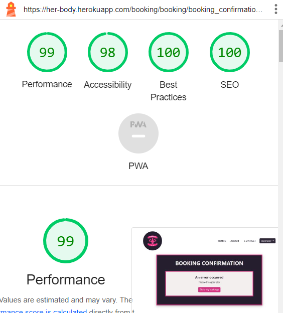

    

    

    
Booking_form

    

    

    

    
Booking_list

    

    

    

    
Delete_booking

    

    

    

    
Edit_booking

    

    

    

    
Edit_booking_confirm

    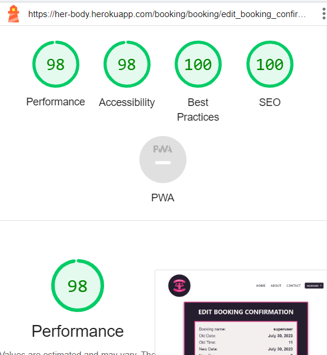

    

 

3. Accounts pages

    

    
Login

    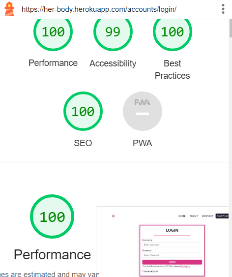

    

    

    
Logout_confirmation

    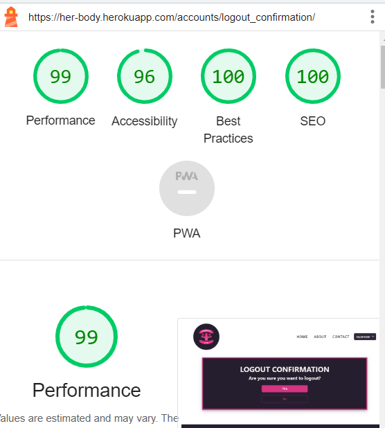

    

    

    
Register

    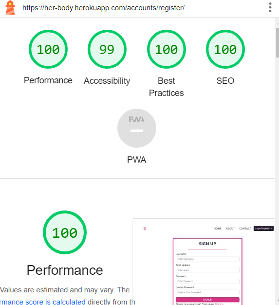

    

3. Contact pages

    

    
Contact

    

    

    

    
Confirmation_contact

    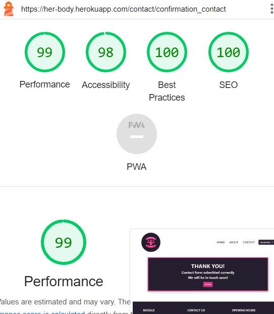

    

 

4. Error pages

Error pages have the same structure as the delete_booking.
After deploying to Heroku, the lighthouse for error pages is not loaded.

Lighthouse mobile:

1. General pages

    

    
Home

    

    

    

    
About

    

    

    

    
Contact

    

    

 

2. Booking pages

    

    
Booking_confirmation

    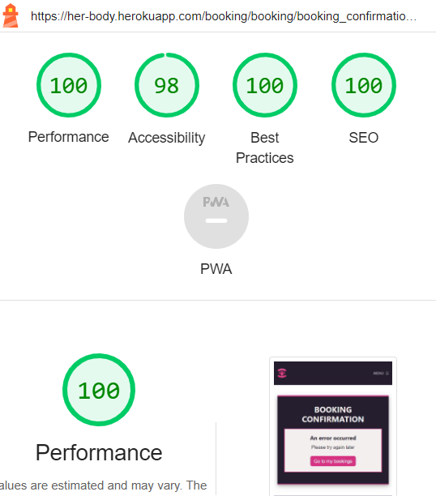

    

    

    
Booking_form

    

    

    

    
Booking_list

    

    

    

    
Delete_booking

    

    

    

    
Edit_booking

    

    

    

    
Edit_booking_confirm

    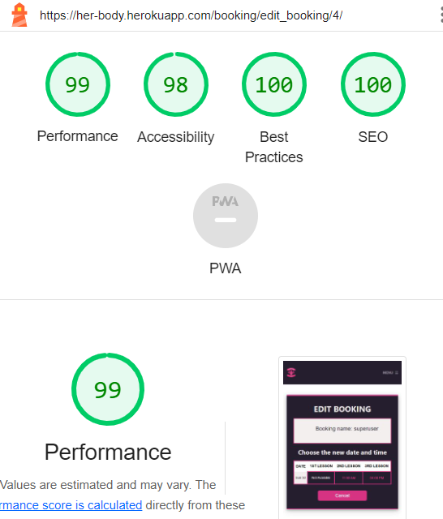

    

 

3. Accounts pages

    

    
Login

    

    

    

    
Logout_confirmation

    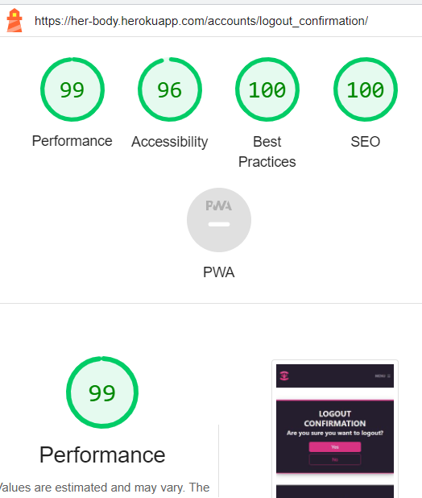

    

    

    
Register

    

    

3. Contact pages

    

    
Contact

    

    

    

    
Confirmation_contact

    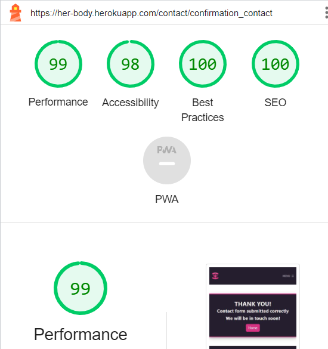

    

    
 

4. Error pages

Error pages have the same structure as the delete_booking.
After deploying to Heroku, the lighthouse for error pages is not loaded.

### Css

All personal css was passed through validator.

Css

### JS

All personal Js was passed through validator.

JS

### HTML

All HTML pages were passed through validator.

Home

About

Contact

Login

Register

Logout

Book a session

Booking list

Booking confirmation

Edit booking

Confirm edit booking

Delete booking

### Python

All python files were checked

## **Bugs**

Many bugs and issues were found by the developer during the making of this application.
Below is a list of all the most important bugs solved and unsolved by the developer.
All bugs were then described in Issues with the Label **Bug**

### Solved 

Many bugs were found by the developer. All bugs are listed here:

- [Bugs solved](https://github.com/michmattera/HerBody/issues?q=is%3Aissue+label%3Abug+is%3Aclosed)

Bugs are listed there, with a comment and an explanation of how the developer solved it.

Bigger issue :

- Heroku deployment: The developer faces a big issue when trying to redeploy to Heroku after finishing stilying and inserting the images. Heroku log would print that it wasn't finding the Cloudinary API. 

    1. Developer changed the API, and repush but same issue. 
    2. Then it set again the debug to TRUE, push, set debug to FALSE and the app was opening. 
    3. Developer then changes again the url and adds static files URL to each page to solve the cloudinary issue.

    

    
Heroku issue

    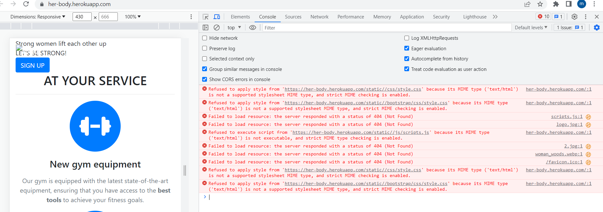

    

### Not solved 

A few small bugs were left unsolved by the developer.

1. HTML validator: In base.html the developer found when doing the HTML validator an end stray tag in the navigation bootstrap, shown below. Even if the developer checks and re-pushes the code to GitHub the validator always find this end div not closed.

    

    
Bug validator

    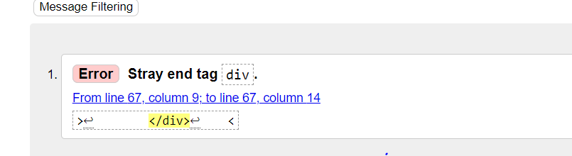

    

2. Logo mobile Apple: The developer found that just in Safari mobile the logo is slightly squeezed. The developer saw that the error is just in Apple while trying responsive on the pc and Android works normally. Below are the differences :

    

    
Bug apple

    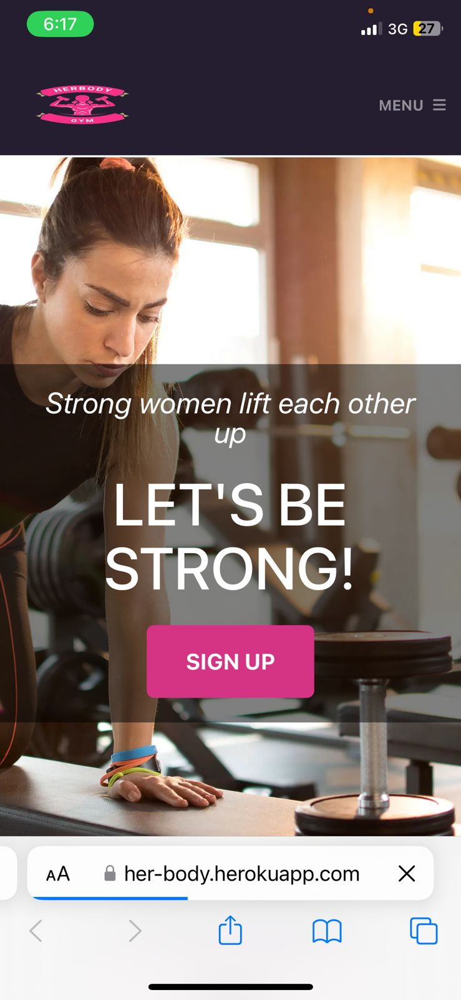

    

    

    
No bug android

    

    

3. Refresh confirmation page: Developer found out that if the user does not click on cancel or confirm but just refreshes the page, the page refresh and says an error occurred, while at the same time, the booking is saved and then appears in the booking list. The developer tried to change the booking form and booking confirmation, but it was brought to another issue, were the booking was not brought up anymore in the page. The developer did not have time to fix it.

    

    
Refresh bug

    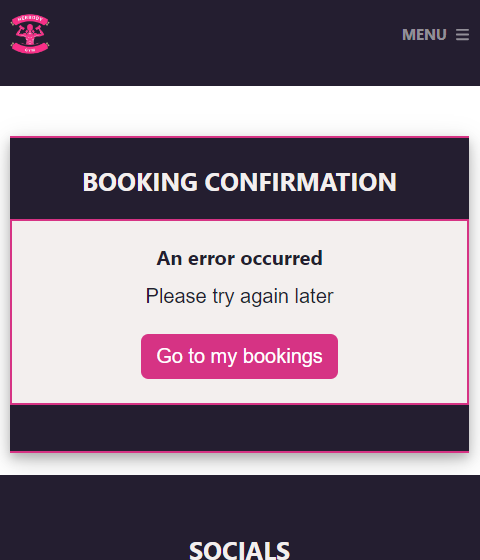

    

## **Responsive**

All pages were tested and checked for responsiveness.

