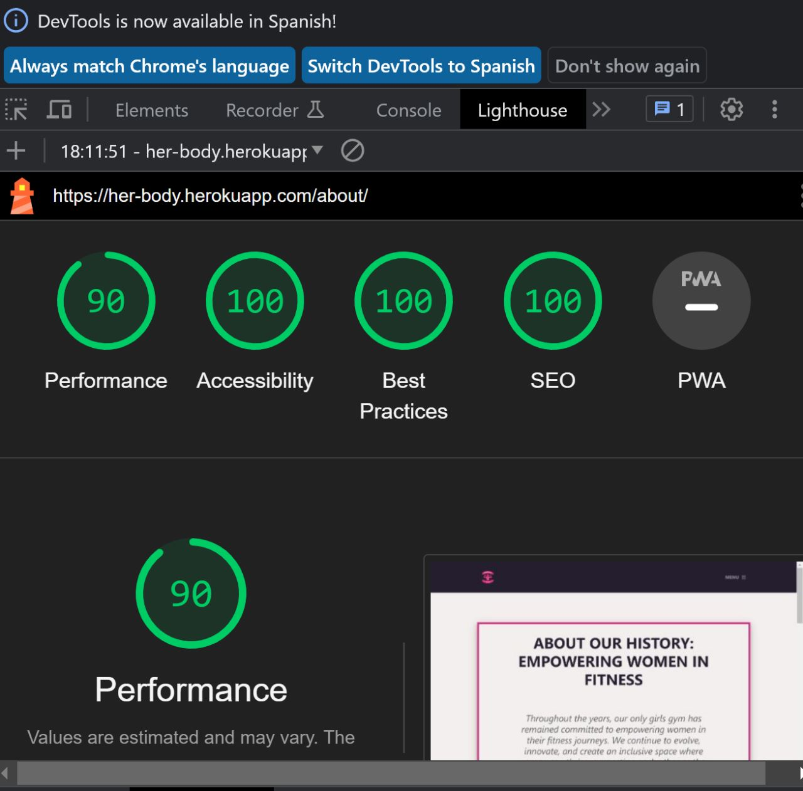
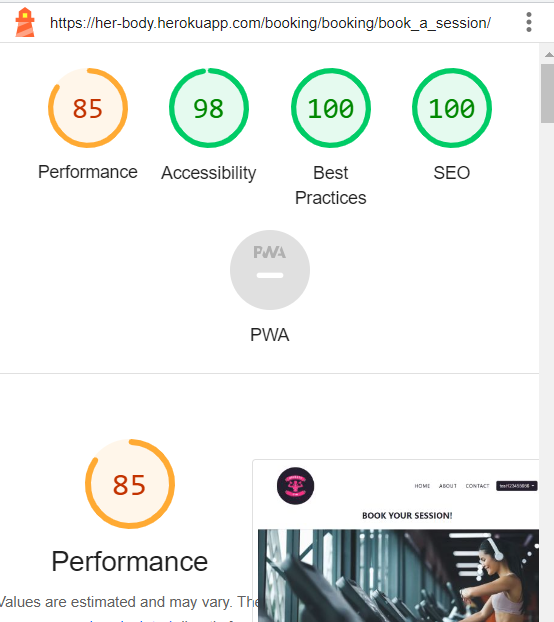

# **HERBODY TESTING**  

[Read Me file](/README.md)

[View Github repository](https://github.com/michmattera/HerBody)

[View the live project here](https://her-body.herokuapp.com/)

## **Table of contents**
***
1. [Browser Testing](#browser-testing)
2. [Unit Testing](#unit-testing)
3. [Manual Testing](#manual-Testing)
    1. [Navigation Buttons](#navigation-buttons)
    2. [Social-Media](#social-media)
4. [Code validator](#code-validator)
     1. [Lighthouse](#lighthouse)
     1. [Css](#css)
     1. [Js](#js)
     1. [Html](#html)
     5. [Python](#python)
5. [Bugs](#bugs)
    1. [Solved](#solved)
    2. [Not solved](#not-solved)
5. [Responsive](#responsive)

## **Browser testing**

The following browser has been tested and checked:

| Browser | Checked |
| --- | --- |
| Google chrome | :heavy_check_mark: |
| Microdoft edge | :heavy_check_mark: |
| Safari|  :heavy_check_mark: |
| Firefox | :heavy_check_mark: |

 Google Chrome:

 Microsoft Edge:

 Safari:

 Firefox:

## **Unit Testing**

Unittest was used by the developer to check the functionality for the django app.
Developer tried to check as much as possible with unittest.
First time using unittest so developer struggle a bit to test all part of the application.

The following file is where the developer worote the Unit Test:

- [Booking Unit Test](booking/tests/)
- [Myproject Unit Test](myproject/tests/)

 Review unittest

## Manual testing

### Navigation Buttons

Navigation logged in

Navigation logged out

### Social-Media

Social media links all opens in new page and are situated in the footer.

Social media

## Code Validator

### Lighthouse

Lighthouse reports were made for all pages , for desktop and mobile.

Lighthouse desktop:

1. General pages

    

    
Home

    

    

    

    
About

    

    

    

    
Contact

    

    

 

2. Booking pages

    

    
Booking_confirmation

    

    

    

    
Booking_form

    

    

    

    
Booking_list

    

    

    

    
Delete_booking

    

    

    

    
Edit_booking

    

    

    

    
Edit_booking_confirm

    

    

 

3. Accounts pages

    

    
Login

    

    

    

    
Logout_confirmation

    

    

    

    
Register

    

    

3. Contact pages

    

    
Contact

    

    

    

    
Confirmation_contact

    

    

 

4. Error pages

    

    
400

    

    

    

    
404

    

    

    

    
500

    

    

Lighthouse mobile:

1. General pages

    

    
Home

    

    

    

    
About

    

    

    

    
Contact

    

    

 

2. Booking pages

    

    
Booking_confirmation

    

    

    

    
Booking_form

    

    

    

    
Booking_list

    

    

    

    
Delete_booking

    

    

    

    
Edit_booking

    

    

    

    
Edit_booking_confirm

    

    

 

3. Accounts pages

    

    
Login

    

    

    

    
Logout_confirmation

    

    

    

    
Register

    

    

3. Contact pages

    

    
Contact

    

    

    

    
Confirmation_contact

    

    

    
 

4. Error pages

    

    
400

    

    

    

    
404

    

    

    

    
500

    

    

### Css

All personal css was passed through validator.

Css

### JS

All personal Js was passed through validator.

JS

### HTML

All HTML pages were passed through validator.

Home

About

Contact

Login

Register

Logout

Book a session

Booking list

Booking confirmation

Edit booking

Confirm edit booking

Delete booking

